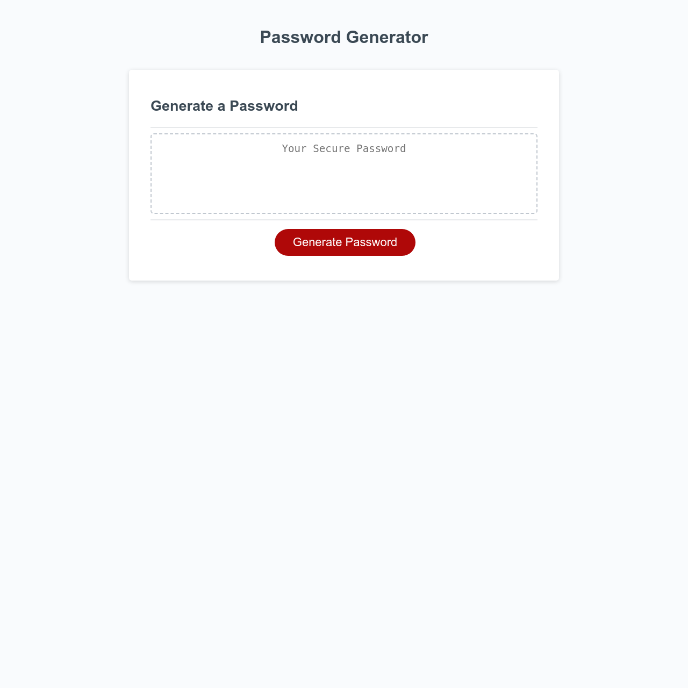

# Bootcamp Project 5 - Password Generator

## Description 

This project was created using HTML, CSS and Javascript to make a Password Generator. The project had the following requirements:

* Generate a password when the button is clicked
  * Present a series of prompts for password criteria
    * Length of password
      * At least 10 characters but no more than 64.
    * Character types
      * Lowercase
      * Uppercase
      * Numeric
      * Special characters ($@%&*, etc)
  * Code should validate for each input and at least one character type should be selected
  * Once prompts are answered then the password should be generated and displayed in an alert or written to the page

The page in this repo is the result.

## Installation

The site does not require installation steps.

## Usage 

The website can be viewed at [https://bowseruk.github.io/web-password-generator/](https://bowseruk.github.io/web-password-generator/) with Google Chrome. The source can be viewed in Chrome by right clicking and selecting inspect.

## Credits

This site was based on a project by edX Boot Camps LLC.

[W3School](https://www.w3schools.com/) was used as a reference for elements to use and good practice.

The changes were checked with [W3C Validator](https://validator.w3.org/).

[Stack Overflow](https://stackoverflow.com/) always seems to have the answer to a problem that occurs.

## License

This project uses the licence in the LICENCE file of the repo.